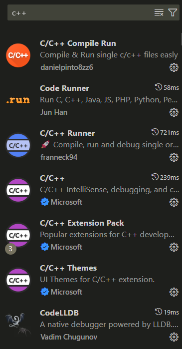

---
date:
  created: 2025-02-05
  # updated: 2025-01-31
authors:
  - Rexyz
categories:
  - 技术
tags:
  - 环境配置
---
# Windows系统在VSCode中配置C/C++环境(直接编译运行和CMake编译运行)

由于VSCode对C/C++的支持性较差，或者是C/C++本身的编译特性所致，导致在VSCode中配置C/C++环境并不像Python那么简便，因此本文将记录一下我配置的过程。

<!-- more -->

## 安装MinGW-W64

首先，我们需要安装MinGW-W64，这是Windows下GCC的编译器，用来编译C/C++代码。

VSCode推荐的GitHub下载地址：<a href="https://github.com/msys2/msys2-installer/releases" target="_blank">https://github.com/msys2/msys2-installer/releases</a>

!!! note "注意"
    MSYS2 需要 64 位 Windows 8.1 及以上版本。

选择Assets中的msys2-x86_64-xxxxxxxx.exe下载安装（其中xxxxxxxx为版本日期）。

安装完成后默认勾选立即运行MSYS2，单击完成。

当按下完成之后，会弹出打开一个 MSYS2 终端窗口。

在此终端中，通过输入以下命令并按回车键，安装 MinGW-w64 工具链：

```bash
pacman -S --needed base-devel mingw-w64-ucrt-x86_64-toolchain
```

当系统提示是否继续安装时，请输入 `Y`并回车。

之后就进入安装过程，稍等片刻。

接着在终端中输入运行以下命令：

```bash
pacman -S mingw-w64-ucrt-x86_64-cmake
```

以安装CMake。

当所有的包都安装好后，即可关闭终端。

## 配置环境变量

打开安装msys64所在的文件夹，打开bin文件夹，在地址栏复制地址，然后将该地址添加到系统环境变量中。

打开PowerShell/CMD，分别（逐行）输入运行以下命令：

```PowerShell
gcc -v
g++ -v
gdb -v
```

如果没有报错且输出版本信息，则说明C/C++编译环境已经配置成功。

## 在VSCode中安装C/C++扩展

在VSCode扩展中搜索并安装以下这些插件。



## 用g++编译器直接编译运行（适用于文件较少的简单工程）

新建文件夹后创建一个C++文件，例如test.cpp，内容如下：

```C++
#include <iostream>

int main() {
    std::cout << "Hello, world!" << std::endl;
    return 0;
}
```

在终端中运行：

```PowerShell
g++ test.cpp -o test
```

就会在当前目录下编译生成test.exe可执行文件。

运行exe文件：

```PowerShell
./test.exe
```

更多内容参考：
<a href="https://blog.csdn.net/m0_47406832/article/details/133798293" target="_blank">https://blog.csdn.net/m0_47406832/article/details/133798293</a>

## 使用CMake工具编译运行（适用于文件结构复杂的工程）

还是上面的测试项目，在根目录下创建一个CMakeLists.txt文件，内容如下：

```CMake
cmake_minimum_required(VERSION 3.15)
project(MyProject)

set(CMAKE_CXX_STANDARD 17)

add_executable(MyProject main.cpp)
```

接下来打开PowerShell（在VSCode中打开可能因为无管理员权限无法运行cmake命令，可以换成外部终端），运行以下命令：

```PowerShell
mkdir build
cd build
cmake ..
ninja
```

其中 `cmake ..`是生成构建文件，`ninja`是编译和构建，将输出 `test.exe`可执行文件。

运行exe文件：

```PowerShell
./test.exe
```

也可以使用下面的命令删除生成的可执行文件：

```PowerShell
ninja clean
```

更多内容参考：
<a href="https://www.runoob.com/cmake/cmake-tutorial.html" target="_blank">https://www.runoob.com/cmake/cmake-tutorial.html</a>

<!-- ## 配置Clang-Format格式化工具

Clang-Format是一个代码格式化工具，可以自动化地将C/C++代码格式化为符合标准的格式。

在VSCode中安装Clang-Format和clangd扩展插件，此时VSCode会提升安装clangd软件，点击install即可。 -->

## .vscode文件夹中的配置

### c_cpp_properties.json

```json
{
  "configurations": [
    {
      "name": "windows-gcc-x64",
      "includePath": [
        "${workspaceFolder}/**"
      ],
      "compilerPath": "G:\\\\msys64\\\\ucrt64\\\\bin\\\\gcc.exe",
      "cStandard": "c17",
      "cppStandard": "c++17",
      "intelliSenseMode": "windows-gcc-x64",
      "compilerArgs": [
        ""
      ]
    }
  ],
  "version": 4
}
```

### launch.json

```json
{
  "version": "0.2.0",
  "configurations": [
    {
      "name": "C/C++ Runner: Debug Session",
      "type": "cppdbg",
      "request": "launch",
      "args": [],
      "stopAtEntry": false,
      "externalConsole": true,
      "cwd": "d:/11VS_code_Saveplace/V2X_cpp/lv1",
      "program": "d:/11VS_code_Saveplace/V2X_cpp/lv1/build/Debug/outDebug",
      "MIMode": "gdb",
      "miDebuggerPath": "G:\\\\msys64\\\\ucrt64\\\\bin\\\\gdb.exe",
      "setupCommands": [
        {
          "description": "Enable pretty-printing for gdb",
          "text": "-enable-pretty-printing",
          "ignoreFailures": true
        }
      ]
    }
  ]
}
```
