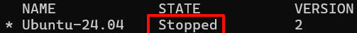

---
date:
  created: 2025-03-07
  updated: 2025-03-07
authors:
  - Rexyz
categories:
  - 技术
tags:
  - 环境配置
---

# WSL环境配置

WSL（Windows Subsystem for Linux）是微软开发的一项技术，允许用户在Windows系统中直接运行完整的Linux环境，无需虚拟机。通过操作系统级虚拟化，WSL将Linux子系统无缝嵌入Windows，提供原生Linux命令行工具、软件包管理器及应用程序支持。它具有轻量化、文件系统集成、良好的交互性及开发效率提升等优点，消除了Windows与Linux之间的隔阂，尤其适合开发者和需在Windows平台上使用Linux工具的用户。

<!-- more -->

## 安装WSL分发版

查看系统上安装的WSL分发版：
```powershell
wsl -l -v
```

设置分发版版本：
```powershell
wsl --set-version <分发版名称> <版本号>
```

查看可以在线安装的WSL分发版：
```powershell
wsl --list --online
```

安装WSL分发版：
```powershell
wsl --install <分发版名称>
```
其中分发版名称需为上面列出的名称之一（注意大小写）。

安装时需要输入默认用户及密码。

此时WSL子系统会默认安装到C盘，可以通过以下命令将其移动到其他盘符。

## WSL子系统迁移到其他盘符

### 停止子系统

查看系统上安装的WSL分发版的运行状态：
```powershell
wsl -l -v
```


需要确保要迁移的子系统处于Stopped状态，如果子系统在运行状态，运行
```powershell
wsl --shutdown
```
以停止子系统。

### 导出WSL子系统备份

新建一个文件夹，然后将子系统的备份文件导出到该文件夹。命令示例：

```powershell
wsl --export Ubuntu-24.04 G:\Ubuntu24.04\Ubuntu2404.tar
```

其中Ubuntu-24.04为子系统名称，G:\Ubuntu24.04为导出路径。

### 注销原子系统

确定在此目录下可以看见备份Ubuntu.tar文件之后，注销原有的wsl子系统。

```powershell
wsl --unregister Ubuntu-24.04
```

### 恢复子系统

将备份文件恢复（导入）为新的子系统：

```powershell
wsl --import Ubuntu-24.04 G:\Ubuntu24.04 G:\Ubuntu24.04\Ubuntu2404.tar
```

这时候启动WSL，发现好像已经恢复正常了，但是默认用户变成了root，之前使用过的文件也看不见了。

### 恢复默认用户

```powershell
Ubuntu2404 config --default-user rex
```

请注意，这里的发行版名称的版本号是纯数字，比如Ubuntu-24.04就是Ubuntu2404。

最后的参数（这里的`rex`）为默认用户名。

## 启动WSL子系统

如果直接运行
```powershell
wsl
```
命令，会以挂载的硬盘为路径启动子系统，而非WSL系统中的路径。

解决办法是用
```powershell
wsl ~
```
来启动，这样启动后默认路径为WSL子系统的home目录。

## 安装Fish Shell

Fish Shell是一款功能丰富的命令行shell，可以用来替代默认的Bash shell。

```bash
sudo apt-add-repository ppa:fish-shell/release-3
sudo apt-get update
sudo apt-get install fish
```

将Fish Shell设置为默认shell：

```bash
chsh -s /usr/bin/fish
```

## 修改默认软件源

将默认软件源更改为国内的镜像源，有助于提升软件安装速度

首先备份原有软件源：

```bash
sudo cp /etc/apt/sources.list /etc/apt/sources.list.bak
```

然后编辑软件源文件：

```bash
sudo vim /etc/apt/sources.list
```

将原有软件源注释掉（如果有的话），然后在<a href="https://mirrors.tuna.tsinghua.edu.cn/help/ubuntu/">清华大学开源软件镜像站</a>找到对应系统的软件源，将其粘贴到文件中保存。

例如Ubuntu-24.04的镜像源为：

```
# 默认注释了源码镜像以提高 apt update 速度，如有需要可自行取消注释
deb https://mirrors.tuna.tsinghua.edu.cn/ubuntu/ jammy main restricted universe multiverse
# deb-src https://mirrors.tuna.tsinghua.edu.cn/ubuntu/ jammy main restricted universe multiverse
deb https://mirrors.tuna.tsinghua.edu.cn/ubuntu/ jammy-updates main restricted universe multiverse
# deb-src https://mirrors.tuna.tsinghua.edu.cn/ubuntu/ jammy-updates main restricted universe multiverse
deb https://mirrors.tuna.tsinghua.edu.cn/ubuntu/ jammy-backports main restricted universe multiverse
# deb-src https://mirrors.tuna.tsinghua.edu.cn/ubuntu/ jammy-backports main restricted universe multiverse
 
deb http://security.ubuntu.com/ubuntu/ jammy-security main restricted universe multiverse
# deb-src http://security.ubuntu.com/ubuntu/ jammy-security main restricted universe multiverse
 
# 预发布软件源，不建议启用
# deb https://mirrors.tuna.tsinghua.edu.cn/ubuntu/ jammy-proposed main restricted universe multiverse
# # deb-src https://mirrors.tuna.tsinghua.edu.cn/ubuntu/ jammy-proposed main restricted universe multiverse
```

接下来更新安装源列表：

```bash
sudo apt update && sudo apt -y upgrade
```

!!! info "小问题"
    这一步会比较慢，耐心等待。

## 安装pip包管理器

Ubuntu系统会自带Python解释器，如Ubuntu24.04默认安装Python3.12.3，但pip包管理器不会自带，需要手动安装：

```bash
sudo apt install python3-pip
```

## 创建python软链接

默认安装的python3.12会有一个python3的软连接，可以进一步创建python软链接到python3.12：

```bash
cd /bin
sudo ln -s python3.12 python
```

这样就可以用`python`命令来运行python3.12了。

!!! danger "谨慎"
    在 Linux 中删除软连接不要使用rm -rf，因为一旦加上`/`就会删除源文件，该操作危险性较高。正确的做法是

    `sudo unlink <link_name>`


## 安装 GIMP

GIMP 是一种免费的开源光栅图形编辑器，用于图像操作和图像编辑、自由形态绘图、不同图像文件格式之间的转码，以及更专业的任务。

```bash
sudo apt install gimp -y
```

若要启动GIMP，可以直接在终端输入：

```bash
gimp
```

## 安装 Nautilus

Nautilus 也称为 GNOME Files，是 GNOME 桌面的文件管理器。 （类似于 Windows 文件资源管理器）。

```bash
sudo apt install nautilus -y
```

若要启动，请输入：

```bash
nautilus
```

## 安装 VLC

VLC 是一种免费的开源跨平台多媒体播放器和框架，可播放大多数多媒体文件。

```bash
sudo apt install vlc -y
```

若要启动，请输入：

```bash
vlc
```

## 安装 X11 应用

X11 是 Linux 窗口管理系统，这是随它一起提供的各种应用和工具的集合，例如 xclock、xcalc 计算器、用于剪切和粘贴的 xclipboard、用于事件测试的 xev 等。有关详细信息，请参阅 <a href="https://www.x.org/wiki/UserDocumentation/GettingStarted/">x.org</a> 文档。

```bash
sudo apt install x11-apps -y
```

若要启动，请输入要使用的工具的名称。 例如：

`xcalc`、`xclock`、`xeyes`

## 安装适用于 Linux 的 Microsoft Edge 浏览器

```bash
## Setup
curl https://packages.microsoft.com/keys/microsoft.asc | gpg --dearmor > microsoft.gpg
sudo install -o root -g root -m 644 microsoft.gpg /usr/share/keyrings/
sudo sh -c 'echo "deb [arch=amd64 signed-by=/usr/share/keyrings/microsoft.gpg] https://packages.microsoft.com/repos/edge stable main" > /etc/apt/sources.list.d/microsoft-edge-dev.list'
sudo rm microsoft.gpg
## Install
sudo apt update
sudo apt install microsoft-edge-dev
```

若要启动，请输入：

```bash
microsoft-edge
```

## 安装网络工具

```bash
sudo apt install net-tools
```

## 安装桌面环境

### 安装Ubuntu桌面版

默认情况下，WSL2安装的是服务器版Ubuntu，没有图形界面。要安装桌面环境，可以根据自己的喜好安装 KDE、Gnome、xfce、lxde 等桌面环境。Gnome是 Ubuntu 的默认桌面上环境，也是多数发行版的默认桌面环境，这里以xfce为例进行安装：

```bash
sudo apt install xubuntu-desktop
```

### 安装XRDP

安装xrdp服务并启动：

```bash
sudo apt-get install xrdp
sudo systemctl start xrdp
```

将xrdp用户添加到ssl-cert用户组：

```bash
sudo adduser xrdp ssl-cert
```

重启xrdp服务：

```bash
sudo systemctl restart xrdp
```

