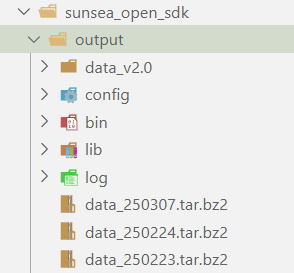
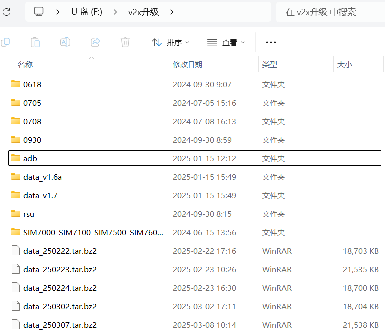
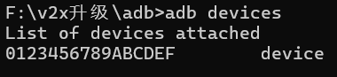
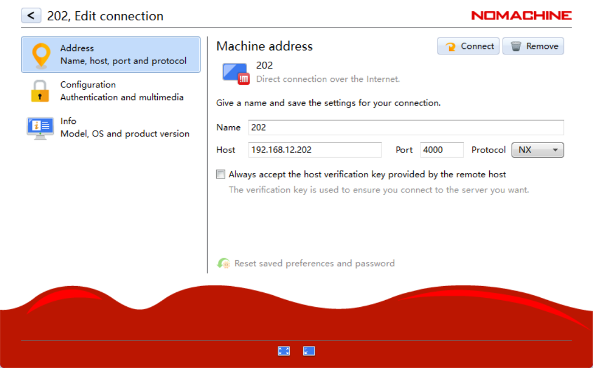

---
date:
  created: 2025-03-07
  updated: 2025-03-08
authors:
  - Rexyz
categories:
  - 开发
tags:
  - 车联网
---
# 车联网车模调试步骤

<!-- more -->

## 源码编译构建

写完代码后，需要编译构建生成可执行文件，才能烧录到车模上运行。

打开终端默认进入home目录（即 `~`），运行以下命令：

```bash
cd sim8800/app
./build.sh
```

!!! info "小问题"
    这里会花费超长一段时间，请耐心等待。

漫长的编译结束后，运行以下命令：

```bash
cd ../sunsea_open_sdk
./make_upgrade_package.sh 250307
```

其中最后的一串神秘代码其实是版本号，可以随便写，一般用当天日期。

运行完成后在sunsea_open_sdk/output目录下会生成一个升级包，将其下载下来备用。



## V2X升级（很抽象的名字）

插入U盘，将刚刚的tar.bz2文件下载到U盘的v2x升级文件夹下。



进入adb文件夹下，在该目录下打开cmd终端（地址栏输入cmd然后回车）。

!!! warning "注意"
    这里只能用cmd终端，用powershell会找不到命令。

用一根数据线连接车模的最上层后方的从左到右的第二个Type-C接口（原来连的那根线拔掉）到电脑上。

在cmd终端中运行

```command
adb devices
```



找到了devices说明连接正确了，如果找不到的话把车上的Type-C端口反过来插试试。

回到v2x升级目录下，打开sim8800升级工具.exe文件，点击打开文件路径，选择刚才下载下来的tar.bz2文件，接着点升级应用。

完成后拔掉数据线，将原来的接口插回去。

## 远程连接车模OBU系统

连接局域网H3C_8956F4，打开NoMachine，



Username为nvidia，password是123456。

## 启动车模

连接上车模主板系统后，打开终端，运行 `adb devices`，返回设备信息说明连接成功。运行 `adb shell`进入设备。

打开三个终端，第一个终端进入adb shell后运行

```bash
ps | grep obu # 得到obu.bin -n 1进程的ID号
kill -9 ID  # 杀死该进程
```

第二个终端进入adb shell后运行

```bash
cd data/data/bin
export LD_LIBRARY_PATH=$LD_LIBRARY_PATH:/data/data/lib
./obu.bin -n 1 # 这句需要在上面kill -9 ID运行后立刻执行
```

第三个终端（不进入adb shell）运行

```bash
cd zgd
./startautoware.sh
```

重新烧录程序后，不想重新启动车模，可以在adb shell的/data/data/bin路径下，执行

```bash
killall *
./msp.bin
```

然后重复上面的步骤即可。

## 车端控制程序调试

在启动车模主板并连接局域网的情况下载资源管理器地址栏输入 `\\192.168.12.202` 进入车端控制程序目录。

进入到
```
\\192.168.12.202\ychdminicar\ychd-planB\src\wheeltec_robot_rc
```
目录下

launch中的 `v2xinterface202.launch`中确定了启动文件，一般是scripts中的v2xinterface文件夹下的.py文件。

修改对应代码后，需要将 `startautoware.sh`程序停止，然后把车模舵机/电机开关关闭后再重新打开，并reset控制板，此后重新运行 `startautoware.sh`程序，车模会以新的程序运动。
