---
date:
  created: 2025-03-16
  updated: 2025-03-17
authors:
  - Rexyz
categories:
  - 技术
tags:
  - 后端
  - 环境配置
---

# FastAPI应用部署到服务器指南

<!-- more -->

## 前置条件
你有一台具有公网IP地址的（云）服务器，并已经安装了Linux 操作系统，如Ubuntu、CentOS等。除此之外，一般还需要有一个解析到该服务器的域名。然后可能还需要在服务器上开放SSH远程连接的端口（这个好像一般都是默认配好的）。

!!! warning "小问题"
    如果你的云服务器是国内运营商提供的，那么将域名解析到该服务器后还需要进行ICP备案才能正常访问。

## 将FastAPI项目代码上传到服务器端
所谓“部署”到服务器，实际上就是把FastAPI应用在服务器端运行起来，所以第一步自然就是把FastAPI项目代码上传到服务器上。那么应该如何上传呢？一般来说服务器上安装的都是Server 版的Linux 操作系统，只有一个黑窗口，并不能直接与Windows 系统交互进行文件传输。想要打破次元壁，可以采取下面几种方法：

### 通过GitHub进行中转
将本地的代码上传到GitHub仓库，然后在服务器上用
```bash
git clone <repository_url>
```
命令克隆。

这是最简单直接的方式，并且如果后续我们在本地又修改了代码，那么在服务器上也可以直接用
```bash
git pull
```
命令更新代码。

不过众所周知GitHub经常需要科学上网才能访问，如果你的服务器是国内的，那很可能连不上GitHub（我就是😭）。解决方法当然就是在服务器上安装翻墙工具，不过在Linux 上相关配置可能会比较复杂，像我这样的懒人就直接放弃折腾了，毕竟我们还有后面的上传方案，是吧？

### 通过SSH远程连接服务器并借助图形化界面实现文件拖动上传
首先需要确保服务器上开放了22端口（SSH远程连接默认端口），可以通过
```bash
netstat -tuln
```
命令查看。
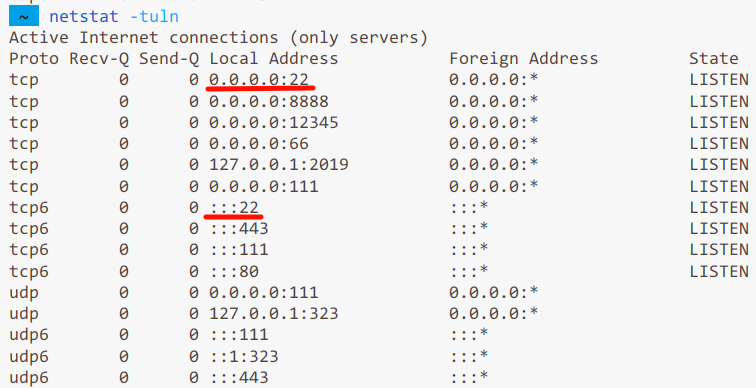
一般出现图中这种情况，就说明22端口是开放的。

如果并未开放的话，运行
```bash
sudo ufw allow 22
```
以允许22端口的通信。

然后在VSCode 中安装Remote-SSH插件。
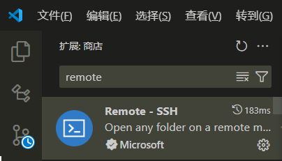

打开远程资源管理器，点"+"按钮添加SSH 远程主机，格式是`ssh <username>@<hostname>`，输入完点确定。
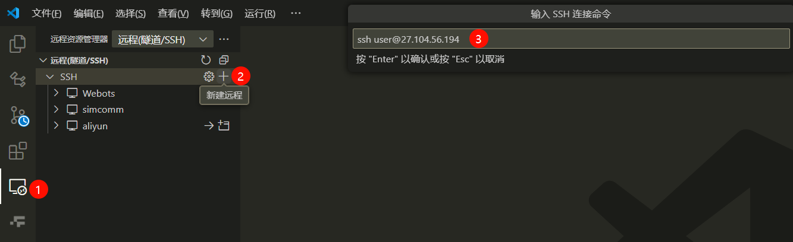

然后点击右下角弹出的窗口中的连接按钮，输入密码后就可以连接到服务器了。
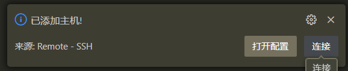

连接后VSCode 会刷新界面，此时默认不会打开任何文件和文件夹。可以在界面左上角点击文件->打开文件夹，然后可以选择进入服务器中的任何目录。

此外也可以点击这个齿轮按钮进入SSH 配置文件，刚刚通过"+"号添加的SSH 远程主机就会出现在这里面，可以手动修改相关信息。
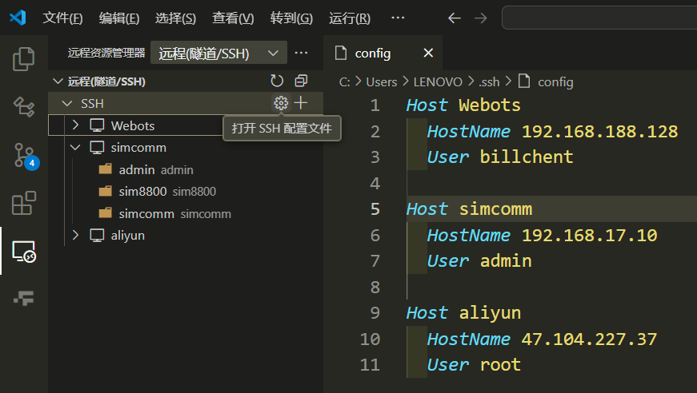

这里面有3个参数：

- Host：主机名，可以随便取，但不能重复
- HostName：服务器IP地址
- User：远程连接时使用的用户名

通过SSH 远程连接服务器后，你可以直接把Windows 系统资源管理器中的文件拖动到VSCode 左边的资源管理器中，从而实现文件上传。
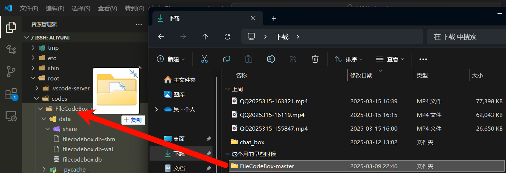

!!! note "小技巧"
    相应地，此时VSCode 左边的资源管理器中的所有文件右键单击后会有一个“下载”选项，这个选项可以把文件从服务器下载到本地。

## 安装 Gunicorn 和 Uvicorn
在服务器端以生产环境的模式运行FastAPI 应用，和在Windows 本地以开发环境的模式运行略有不同，这里推荐使用Gunicorn with Uvicorn Workers的部署方式。

运行
```bash
pip install "uvicorn[standard]" gunicorn
```
将Uvicorn 和 Gunicorn 安装到虚拟环境中。

## 运行 Gunicorn
接下来你可以通过以下命令运行Gunicorn:
```bash
gunicorn main:app --workers 4 --worker-class uvicorn.workers.UvicornWorker --bind 0.0.0.0:66
```
其中`main:app`是你的FastAPI 应用的入口点，`--workers`是工作进程数量，`--worker-class`是工作进程类型，`--bind`是绑定的IP地址和端口。这里面需要注意的是最后的bind参数，IP地址必须是`0.0.0.0`，端口则可以任意选择（只要不是被占用即可），并且不建议使用80端口，因为80端口是HTTP协议的默认端口，可能会与其他服务冲突。对应地，22端口（SSH远程连接默认端口）和443端口（HTTPS协议默认端口）也不建议使用。

运行Gunicorn 后，你的FastAPI 应用就已经暴露到公网上了，此时可以通过`<IP地址>:<端口>`访问到你的应用。

!!! warning "注意"
    由于这里使
    `gunicorn`命令运行项目，而不是直接以`main.py`为入口执行Python 脚本，因此写在`if __name__ == '__main__':`代码块中的代码不会被执行，请将原本置于其中的代码移到外面以保证正常执行。

但此时你将会发现一旦使用++ctrl+c++关闭上面的进程或者直接退出SSH 连接，你的FastAPI 应用就会停止运行。想要让进程能够自动保活，可以采取下面的方法：

### 使用Docker部署FastAPI应用
这是比较专业的部署方式，具有很高的可靠性。但缺点是配置非常麻烦，而且在低配的服务器上（我们白嫖的一般都是最低配的）可能会出现性能问题，没有办法流畅运行。所以对于简单的小项目一般还是建议使用下面的方法。（其实是因为我还不会用Docker 😂）

### 使用nohup命令（推荐）
这是比较简单粗暴的方法。

使用nohup命令可以将进程放入后台运行，并且在退出SSH 连接后，进程依然能够保持运行。

运行
```bash
nohup gunicorn main:app --workers 4 --worker-class uvicorn.workers.UvicornWorker --bind 0.0.0.0:66 &
```
其中`&`是将进程放入后台运行的命令。

以该方式运行会在你的项目根目录下生成一个nohup.out 文件，里面记录的是运行日志，也就是之前直接运行时在终端中看到的输出内容。

此时可以用
```bash
ps -ef | grep gunicorn
```
命令查看进程是否在运行以及进程号。

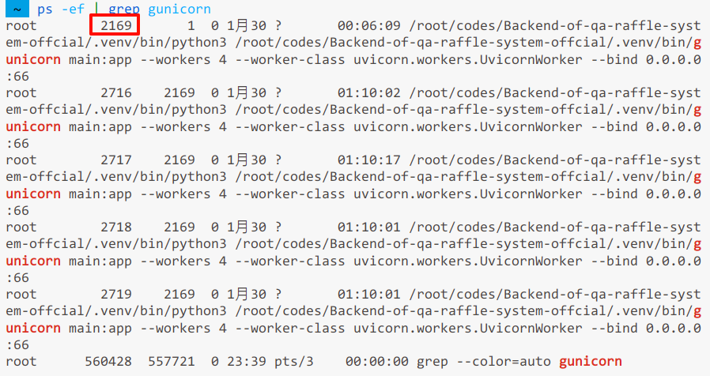

我们开了4个工作进程，所以这里会显示4个，但实际上后面3个都是第1个子进程。

想要结束该进程，可以用
```bash
kill -9 <进程号>
```
命令，其中`<进程号>`是上一步中显示的进程号（第一个）。

然后再运行`ps -ef | grep gunicorn`命令，可以看到已经没有任何进程了。

!!! info "注意"
    如果你对项目中的代码进行了修改，那么必须要先结束现有的Gunicorn 进程，然后再重新运行，才能看到修改后的效果。

## 用Caddy 做反向代理
这部分可以去看看<a href="https://caddy2.dengxiaolong.com/docs/">Caddy的官方文档</a>。懒得看的话，就按下面的省流版来吧～

### 安装Caddy
安装稳定版本的Caddy：
```bash
sudo apt install -y debian-keyring debian-archive-keyring apt-transport-https
curl -1sLf 'https://dl.cloudsmith.io/public/caddy/stable/gpg.key' | sudo gpg --dearmor -o /usr/share/keyrings/caddy-stable-archive-keyring.gpg
curl -1sLf 'https://dl.cloudsmith.io/public/caddy/stable/debian.deb.txt' | sudo tee /etc/apt/sources.list.d/caddy-stable.list
sudo apt update
sudo apt install caddy
```

### 配置Caddy 代理
安装完成后会生成/etc/caddy目录，里面有Caddy的配置文件Caddyfile（如果没有的话自己创建一个）。
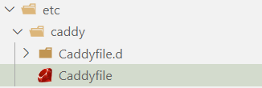

在Caddyfile中添加以下内容：
```
<你的域名> {
  reverse_proxy 0.0.0.0:<FastAPI应用运行端口>
  encode gzip
}
```
其中运行端口是你在执行
```bash
nohup gunicorn main:app --workers 4 --worker-class uvicorn.workers.UvicornWorker --bind 0.0.0.0:66 &
```
命令时指定的端口，比如这里是66。

域名就是你挂载到服务器上的域名，当然像这样的后端服务一般都会代理到一个子域名上。

一般来说购买域名时获得的都是二级域名，例如`rrrexyz.icu`，在服务器的管理面板中可以将其子域名解析到你的服务器IP上。
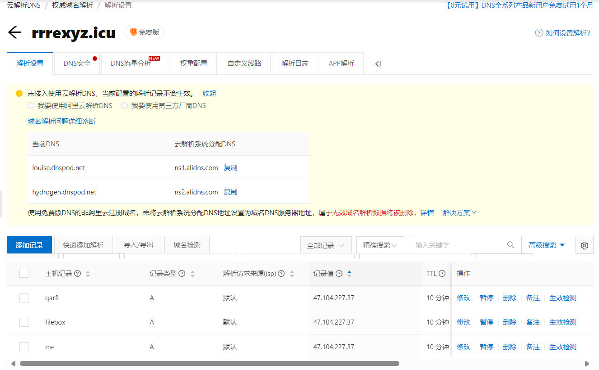

!!! success "注意"
    子域名解析后一般需要过十几分钟到几小时才会生效，所以如果你的域名还没有解析成功，请耐心等待。

比如说我就把问答抽奖系统的后端服务反向代理到了`qarfl.rrrexyz.icu`这个子域名上，配置文件中的写法是：
```
qarfl.rrrexyz.icu {
    reverse_proxy 0.0.0.0:66
    encode gzip
}
```

添加完毕保存文件后，需要执行以下命令使配置生效：
```bash
systemctl restart caddy
```
之后只要对Caddyfile文件的内容做出了修改，都需要使用该命令刷新caddy。

可以用
```bash
systemctl status caddy
```
命令查看caddy的运行状态。
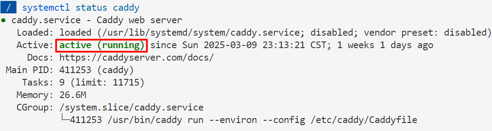
Active状态为active（running）表示caddy已经正常运行。

随后，Caddy会自动帮我们申请配置好SSL证书，我们可以通过`https://<你的域名>`访问到对应的FastAPI应用。
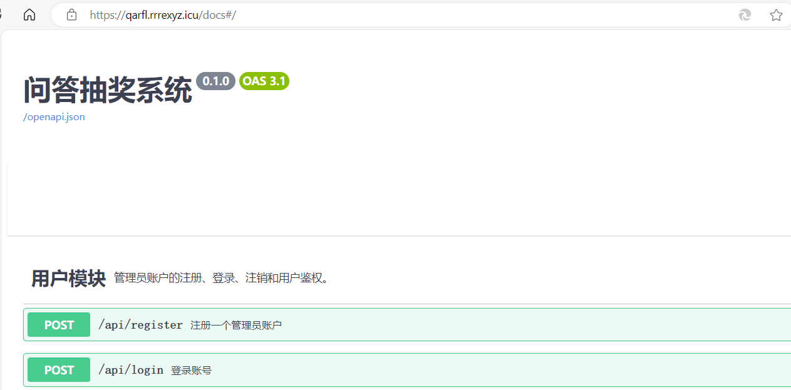