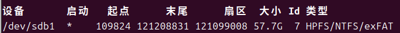

---
date:
    created: 2025-03-31
    updated: 2025-03-31
authors:
    - Rexyz
categories:
    - 技术
tags:
    - 环境配置
---

# 在Ubuntu上挂载U盘

今天因为一些原因，需要在Ubuntu上用U盘拷贝一些文件，此时忽而发现Ubuntu上并没有Windows上直接识别U盘的功能，捣鼓了一番，终于找到了挂载U盘的方法，遂写本文记录一下。

<!-- more -->

## 查看系统上的设备
插入U盘后，使用以下命令查看系统上的设备：
```bash
sudo fdisk -l
```
然后在输出内容的最后可以看到U盘的设备名，一般是`/dev/sdbX`，其中`X`为数字。


随后运行
```bash
df
```
查看U盘是否已经挂载。

## 挂载U盘
如果U盘没有挂载的话，可以使用以下命令挂载：
```bash
sudo mount /dev/sdbX /mnt
```

这样U盘就挂载在`/mnt`目录下了。可以直接`cd /mnt`进入挂载目录，进行文件相关操作。

## 卸载U盘
使用完以后在拔出U盘前，需要手动卸载U盘，以防止内部数据损坏。运行：
```bash
sudo umount /mnt
```
确保运行`df`命令后U盘已经不在挂载列表中即可拔出U盘。

!!! warning "注意"
    卸载U盘时需要保证挂载目录未被占用，否则会操作失败。